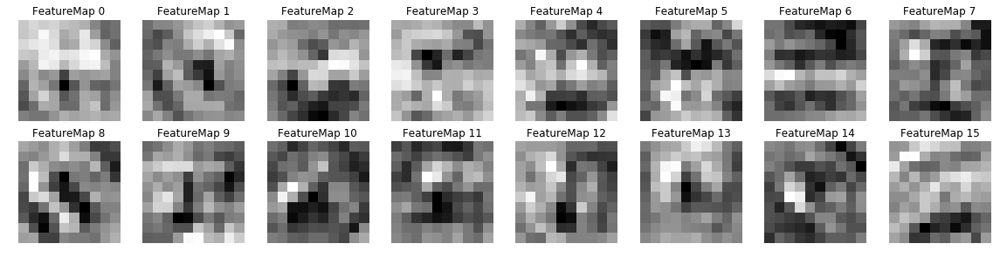

# **Traffic Sign Recognition** 

---

**Build a Traffic Sign Recognition Project**

The goals / steps of this project are the following:
* Load the data set (see below for links to the project data set)
* Explore, summarize and visualize the data set
* Design, train and test a model architecture
* Use the model to make predictions on new images
* Analyze the softmax probabilities of the new images
* Summarize the results with a written report

[//]: # (Image References)

[image1]: ./examples/visualization.jpg "Visualization"
[image2]: ./examples/grayscale.jpg "Grayscaling"
[image3]: ./examples/random_noise.jpg "Random Noise"
[image4]: ./examples/placeholder.png "Traffic Sign 1"
[image5]: ./examples/placeholder.png "Traffic Sign 2"
[image6]: ./examples/placeholder.png "Traffic Sign 3"
[image7]: ./examples/placeholder.png "Traffic Sign 4"
[image8]: ./examples/placeholder.png "Traffic Sign 5"

## Rubric Points
### Here I will consider the [rubric points](https://review.udacity.com/#!/rubrics/481/view) individually and describe how I addressed each point in my implementation.  

---
### Writeup / README

#### 1. Provide a Writeup / README that includes all the rubric points and how you addressed each one. You can submit your writeup as markdown or pdf. You can use this template as a guide for writing the report. The submission includes the project code.

You're reading it! and here is a link to my [project code](https://github.com/machinehead/CarND-Traffic-Sign-Classifier-Project/blob/master/Traffic_Sign_Classifier.ipynb)

### Data Set Summary & Exploration

#### 1. Provide a basic summary of the data set. In the code, the analysis should be done using python, numpy and/or pandas methods rather than hardcoding results manually.

I used the pandas library to calculate summary statistics of the traffic
signs data set:

* The size of training set is 34799
* The size of the validation set is 4410
* The size of test set is 12630
* The shape of a traffic sign image is (32, 32, 3)
* The number of unique classes/labels in the data set is 43

#### 2. Include an exploratory visualization of the dataset.

Here is an exploratory visualization of the data set. This image shows sign images from the training data set taken at equally spaced intervals:

Here are bar charts showing distribution of labels in training and validation sets:

### Design and Test a Model Architecture

#### 1. Preprocessing

My preprocessing code consists of the following steps:
* Equalize histogram in brightness channel (YUV) - makes sure every image has the same range of brightness, makes dark images more bright.
* (Unsharp mask) - I tried to use this filter, but didn't get any significant improvement. It's probably due to the fact that:
  * Convolutional layers can potentially build something similar to this, since this is just a smoothing kernel followed by a subtraction
  * Validation set accuracy was already about 99.2% when I was implementing this, which means the network only makes around 35 mistakes in 4410 images - at this point it might be just not sensitive enough to do any further improvements. I would need a bigger validation set to find improvements in the remaining 1% of accuracy score.
* Convert to grayscale - I think this step could actually be done by a 1x1 convolution layer, but didn't get it to work in practice; also, normalization in grayscale has a nice effect of keeping every image visually understandable, which helps to visualize network activations.
* Subtract mean - makes sure pixel values are centered at 0 for every image.
* Divide by std. dev. - makes sure pixel values have a standard deviation of 1 for every image.

I decided to generate additional data because of two reasons:
* The initial network seemed to easily overfit the training dataset, so I assumed having a bigger dataset will help avoid overfitting.
* Some of the sign classes have very few examples; generating more images can help improve detecting those classes.

To add more data to the the data set, I used the following techniques:
* Rotating by a random angle between -13 and 13 degrees
* Scaling between 0.9 and 1.1
* Translating between -2 and 2 pixels in both X and Y directions
* Scaling on individual axis between 0.8 and 1.2

While implementing this, I was constantly making sure the result still looks like images from the dataset.
I had an interesting problem here when I applied each of these transformations separately using cv2.warpAffine. When I realized that doing this loses a lot of image quality due to pixel interpolation, I replaced it with building a transformation matrix and doing cv2.warpAffine once, instantly getting from 98% to 99% validation set accuracy.

Since the images are standardized before augmentation, I assume that it's safe to pad new images with 0s when they are made smaller or rotated.

Here is an example of an original image (top left) and 10 augmented images:

The difference between the original data set and the augmented data set is the following:

* Each original image is duplicated so that the ratio between original images and new images is kept to 1:5.
* 10 random copies of the original image are added to the dataset.

Thus, the size of the training set goes up from 34799 to 12 x 34799 = 417588 images.

#### 2. Final model architecture

My final model consisted of the following layers:

| Layer         		|     Description	        					| 
|:---------------------:|:---------------------------------------------:| 
| Input         		| 32x32x1 grayscale image   					| 
| Convolution 3x3     	| 1x1 stride, valid padding, outputs 30x30x8 	|
| RELU					|												|
| Convolution 3x3     	| 1x1 stride, valid padding, outputs 28x28x8 	|
| RELU					|												|
| Max pooling	      	| 2x2 stride,  outputs 14x14x8 	    			|
| Convolution 5x5     	| 1x1 stride, valid padding, outputs 10x10x16 	|
| RELU					|												|
| Max pooling	      	| 2x2 stride,  outputs 5x5x16    				|
| Fully connected		| 100 outputs        							|
| RELU	    			|            									|
| Dropout				| Ignores 50% of data during training			|
| Fully connected		| 43 outputs        							|
| Softmax				|												|
 

#### 3. Describe how you trained your model.

To train the model, I used an Adam optimizer with a batch size of 128, 10-100 epochs and learning rate of 0.001.
I took these parameters from the video lectures and they seemed to work well, so didn't need to change anything.

#### 4. Model creation approach.

My final model results were:
* training set accuracy of 99.4%;
* validation set accuracy of 99.2%;
* test set accuracy of 97.3%.

My first architecture was LeNet from the video lectures.

First I noticed that 5x5 convolution windows are too big and decreased it to 3x3 windows.
After that I noticed the network was overfitting the training set, so I started removing layers.
Next I figured out that the basic network that achieves above 93% accuracy consists of 2 convolution layers and one fully connected layer - found that by removing layers and verifying accuracy.
After that I kept tweaking the layers, layer sizes, preprocessing, augmentation, etc.

The biggest single improvement probably came from using a dropout layer after the first fully connected layer. 
This chart illustrates the training process without a dropout layer:

This chart illustrates the improvement in accuracy after a 50% dropout layer was introduced:

### Test a Model on New Images

#### 1. Choose five German traffic signs found on the web and provide them in the report. For each image, discuss what quality or qualities might be difficult to classify.

Here are five German traffic signs that I found on the web:

  
   

#### 2. Model performance for new traffic signs

Here are the results of the prediction:

| Image              |       Prediction   | Second best         |
|:------------------:|:------------------:|:-------------------:|
|                Stop|                Stop| Speed limit (60km/h)|
|         No vehicles|Speed limit (80km/h)|Speed limit (100km/h)|
|          No passing|Speed limit (80km/h)| Speed limit (60km/h)|
|       Priority road|       Priority road| Roundabout mandatory|
|Speed limit (50km/h)|Speed limit (50km/h)| Speed limit (60km/h)|
|                Stop|                Stop| Speed limit (60km/h)|
|Speed limit (50km/h)|Speed limit (60km/h)| Speed limit (50km/h)|

The model was able to correctly guess 4 of the 7 traffic signs, which gives an accuracy of 57%. This is very different from the model performance on the test set. It probably means that some of the images are very different from the images in the training set. Visually they do look pretty different.

#### 3. Model certainty

The model is pretty certain for both it's correct and incorrect predictions. The only image where the top class probability is less than 0.99 is image 3 (No passing); yet the correct answer is not even in the top 5.

Image 1 (Stop):

|Prediction                                        |Probability|
|:------------------------------------------------:|:---------:|
|                                              Stop|       1.00|
|                              Speed limit (60km/h)|       0.00|
|                                        Keep right|       0.00|
|                              Speed limit (80km/h)|       0.00|
|                              Speed limit (50km/h)|       0.00|

Image 2 (No vehicles):

|Prediction                                        |Probability|
|:------------------------------------------------:|:---------:|
|                              Speed limit (80km/h)|       1.00|
|                             Speed limit (100km/h)|       0.00|
|                                       No vehicles|       0.00|
|                              Speed limit (30km/h)|       0.00|
|                              Speed limit (60km/h)|       0.00|

Image 3 (No passing):

|Prediction                                        |Probability|
|:------------------------------------------------:|:---------:|
|                              Speed limit (80km/h)|       0.71|
|                              Speed limit (60km/h)|       0.25|
|                                     Priority road|       0.02|
|                              Roundabout mandatory|       0.01|
|End of no passing by vehicles over 3.5 metric tons|       0.01|

Image 4 (Priority road):

|Prediction                                        |Probability|
|:------------------------------------------------:|:---------:|
|                                     Priority road|       1.00|
|                              Roundabout mandatory|       0.00|
|                                              Stop|       0.00|
|                                          No entry|       0.00|
|                             Speed limit (100km/h)|       0.00|

Image 5 (Speed limit (50km/h)):

|Prediction                                        |Probability|
|:------------------------------------------------:|:---------:|
|                              Speed limit (50km/h)|       1.00|
|                              Speed limit (60km/h)|       0.00|
|                              Speed limit (80km/h)|       0.00|
|                              Roundabout mandatory|       0.00|
|                              Speed limit (30km/h)|       0.00|

Image 6 (Stop):

|Prediction                                        |Probability|
|:------------------------------------------------:|:---------:|
|                                              Stop|       1.00|
|                              Speed limit (60km/h)|       0.00|
|                              Speed limit (30km/h)|       0.00|
|                                       No vehicles|       0.00|
|                              Speed limit (50km/h)|       0.00|

Image 7 (Speed limit (50km/h)):

|Prediction                                        |Probability|
|:------------------------------------------------:|:---------:|
|                              Speed limit (60km/h)|       1.00|
|                              Speed limit (50km/h)|       0.00|
|                              Speed limit (80km/h)|       0.00|
|                                              Stop|       0.00|
|                                        Keep right|       0.00|

### Visualizing the Neural Network

Here's the visualization of the first convolutional layer filters:

It's easy to see some diagonal, vertical and horizontal edge filters here - images that are white on one side and black on the other. 

Let's walk through the network activations layer by layer using the following input image:

Here is the input multiplied by weights of layer 1. Looks like neuron number 2 is performing inverse while number 8 is identity.

Layer 1 ReLU activations. Neuron number 2 is high on background and number 8 is only high on the traffic sign itself. Other neurons are performing edge detection.

Layer 2 input. Looks as if highlighting edges from different directions.

Layer 2 ReLU. Keeps only the highlighted edges of the traffic sign

Layer 2 Max pooling. Reduces dimensionality.

The remaining images are Layer 3 activations, layer 3 ReLU and layer 3 max pooling. They are very hard to interpret for me.

